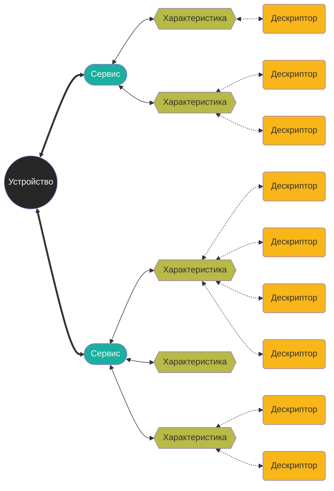

Youtube-запись от `2025-09-12`: https://youtu.be/d593cSFxXfg


# Подключаемся к BLE-устройствам

### Рабочие устройства

|X6|A3:49:3D:8F:A5:2C||
|---|---|---|
|D110|C1:34:01:06:24:52||
|Aquara T1|случайный||
||||
|M5StickPlus2|F0:24:F9:97:70:32||
|Casio WS-B1000|EF:C5:C2:AA:96:39||
|Gan 356 i3|AB:12:34:5E:4C:F6||
|Godox|A4:C1:38:BD:B9:0E||

## BLE-рычаги устройства



- У характеристик есть **свойства** — что-то вроде `.h`-файлов. Объявленные возможности.
- Через **дескрипторы** эти возможности настраивают и включают/выключают.
- А сами возможности запрашивают у **характеристик**.

**UUID**
- Есть у сервисов и характеристик
- Есть стандартные и нестандартные

**Handle**
- Есть у характеристик и дескрипторов
- Реализация свойств — через handle характеристики
- Настройка — через handle дескриптора

Устройство вещает

### Мы можем:

- прочитать, что оно навещало (есть флаги)
- подключиться, и там уже…
    - подписаться на сообщения (с подтверждением доставки или без)
    - читать данные из характеристик
    - писать данные в характеристики

## Минимум полезных команд, чтобы разобраться

## Устройства и их сервисы

```bash
bluetoothctl
```

`scan on/off`

`scan off`

`devices`

`connect <MAC>`

`info <MAC>`

### Набор характеристик конкретного устройства

```bash
gatttool -b <MAC> --characteristics
```

### Маски характеристик

|**Hex**|**Свойство**|**Значение**|
|---|---|---|
|0x01|Broadcast|редко используется|
|0x02|Read|можно читать|
|0x04|Write Without Resp|писать без подтверждения|
|0x08|Write|писать с подтверждением|
|0x10|Notify|устройство может присылать уведомления|
|0x20|Indicate|уведомления с подтверждением|

### Интерактив

```bash
gatttool -I
```

`connect <MAC>`

`characteristics`

`char-desc`

`char-read-uuid <UUID>`

`char-write-req <handle> <bin>`

### Интересные стандартные UUID дескрипторов

|**UUID (16-бит)**|**Название**|Что там|
|---|---|---|
|**0x2900**|Characteristic Extended Properties|Доп. флаги (например, поддержка Reliable Write, Writable Auxiliaries).|
|**0x2901**|Characteristic User Description|Текстовое описание характеристики (строка, читается как Read).|
|**0x2902**|Client Characteristic Configuration (CCCD)|Управление **Notify/Indicate**:  0100 → Notify,  0200 → Indicate,  0000 → выкл.|
|**0x2904**|Characteristic Presentation Format|Формат значения: тип (int/float), единицы измерения, масштаб, экспонента.|

### Эфир

```bash
btmon
```

> [Wireshark](https://www.wireshark.org), если вам маловато будет

## gattlib — относительно удобная C-библиотека

- скомпилированные примеры `build/examples`
- код примеров `examples/`
