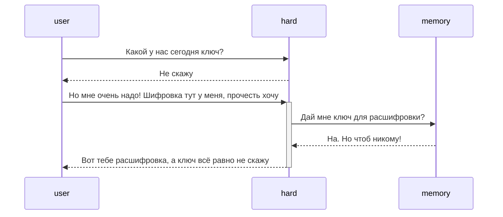
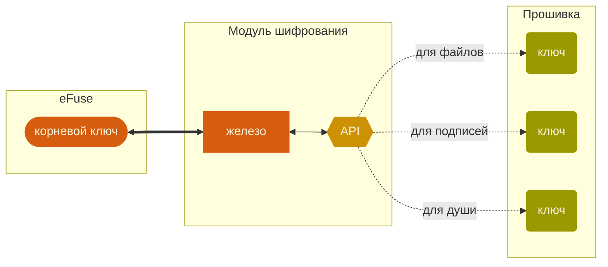
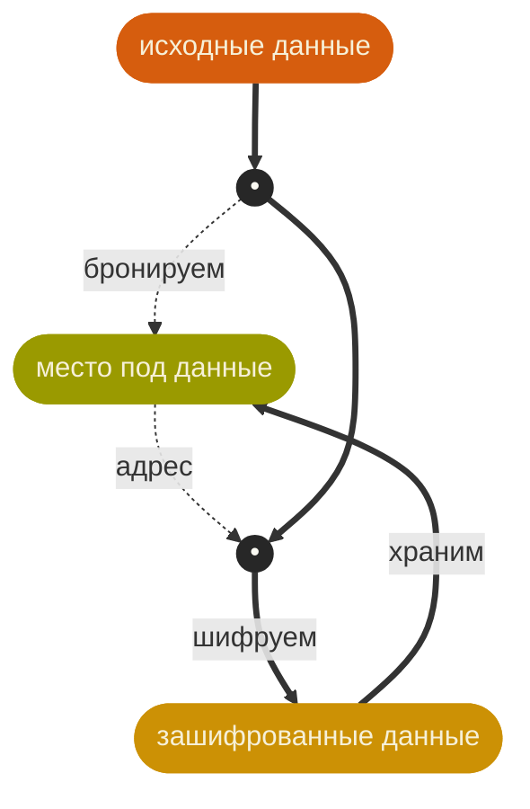

Youtube-запись от `2026-03-06`: https://youtu.be/JeJYn57euCA

# Шифруемся на микроконтроллере
> [!NOTE]
> Добыли секретный секрет

> [!CAUTION]
> И куда его теперь?!

## Если у вас есть операционка — всё прекрасно
- Легко настроить или использовать шифрование
- Дешифрование — тоже не проблема
- И можно хранить в обычных файлах — просто зашифрованных
- Самое простое и широко доступное: [gpg](https://gnupg.org) • [pass](https://www.passwordstore.org) • [git](https://git-scm.com)

## А если нет?

### Что нам вообще нужно прятать?
1. Сами данные.
2. Ключ к ним.

> [!NOTE]
> Внезапно ключ тоже надо куда-то спрятать.
> А мы-то привыкли, что за нас это делает операционка.

### Где прятать будем?
Что значит *«прятать»*?

Закрыть прямой доступ некоторым особо активным товарищам:
- исполняемому на микроконтроллере коду
- внешним интерфейсам прямого доступа типа `UART` и `JTAG`
 
Такой **модели угроз** нам в быту уж точно хватит.

---

Допустим, прямой доступ закрыт…

Тогда нужен доступ через посредника?

**Да!**

И посредником будет аппаратный модуль шифрования в микроконтроллере.



> [!NOTE]
> Выбор человечества — eFuse.
> Он под это и заточен.

Ещё более интересным выбором был бы внешний крипточип. Но считать эту опцию повсеместно доступной мы *сейчас* не будем.

> [!NOTE]
> И есть ещё один экзотический вариант.
> Считать «ключом» труднодоступные физические параметры.

#### А ассортимент у нас, кстати, ой какой богатый
- ROM
- Program Flash
- Оперативная память
- RTC RAM
- eFuse
- Internam EEPROM
- External SPI NOR Flash
- External SPI NAND Flash
- Внешняя оперативная память
- External FRAM
- Externam EEPROM
- SD/microSD
- Внешний крипточип

#### Только есть одна проблемка
eFuse — одноразовая память.
Один раз записал — уже ничего не поменяешь.
И как нам тогда записывать туда ключи каждые 5 минут?!

> [!CAUTION]
> Основная идея: сделаем вид, что ключ там уже есть.

Это будет ключ-матка. Корневой ключ. Прапраключ.

И пусть из него появляются другие ключи-потомки.

Один корневой ключ устройства → разные ключи под задачи.




#### Мееееееедленно добавим ключ в eFuse
Посмотрим, какие блоки в `eFuse` нам вообще доступны:
```
espefuse.py --chip esp32s3 --port /dev/ttyACM0 summary
```
Создадим ключ — 32 случайных HEX-числа — и положим в наши закрома:
```
openssl rand -hex 32 | pass insert -f -m mcu/esp32/rootkey
```
Из закромов вытащим в бинарный файл:
```
pass show device/esp32/rootkey | xxd -r -p > hmac_key.bin
```
И осталось только 🔥🔥🔥 [прожечь ключ в eFuse](https://docs.espressif.com/projects/esptool/en/latest/esp32s3/espefuse/burn-key-cmd.html):
```
espefuse.py --chip esp32s3 --port /dev/ttyACM0 burn_key BLOCK_KEY0 hmac_key.bin HMAC_UP
```


Потом бинарный файл, конечно, удалим.

#### Создадим ключ для задач прошивки
- [HMAC](https://docs.espressif.com/projects/esp-idf/en/v5.5.3/esp32s3/api-reference/peripherals/hmac.html) — как раз умеет работать с ключами в eFuse
- Главное, что он не вытаскивает ключи из eFuse совсем никогда
- Формально `HMAC` генерит не ключ, ~~а ключесодержащий продукт,~~ но — тоже годится

#### Пошифруем немножко
Во-первых, это красиво:
> …**просто** указываем явный секретный ключ в коде, считаем `HMAC-SHA256` и печатаем результат в `UART`. Делаем это через `Mbed TLS`, который встроен в `ESP-IDF`. В `IDF` есть поддержка `Mbed TLS` и аппаратного ускорения `AES/SHA` через конфиг.

> [!NOTE]
> Основная идея: вызов абстрактней, реализация «железней»

- [Mbed TLS](https://docs.espressif.com/projects/esp-idf/en/stable/esp32/api-reference/protocols/mbedtls.html) — *маленькая* C-библиотека для криптографии
- [AES](https://ru.wikipedia.org/wiki/AES_(стандарт_шифрования)) — алгорифм, который реализован *аппаратно* очень много где

> [!CAUTION]
> C1 XOR C2 == P1 XOR P2

Это значит, что нельзя два раза шифровать с одними и теми же настройками.

##### Внимание, меняется режим ~~да не тот~~
`ECB` — Electronic Codebook

`CBC` — Cipher Block Chaining

`CTR` — Counter mode

`GCM` — Galois Counter Mode

`XTS` — XEX-based Tweaked-CodeBook mode with ciphertext Stealing

*Ну класс, теперь у нас появился ещё один суперсекретный ключ?! Ах ты ж…*

На самом деле нет.

Нам **просто** нужно сделать настройки одноразовыми.

Например, жёстко привязать их к физическому месту хранения шифруемых данных.


**Всё!** Теперь данные и их nonce намертво связаны. И nonce уникален.

#### Храним и читаем зашифрованное
> [!NOTE]
> Эх, хорошо бы просто сказать: данные, шифруйтесь!
> И оказывается, мы можем это сделать.
> Великая сила уровней абстракции.

…но про NVS уже точно не в этот раз.


