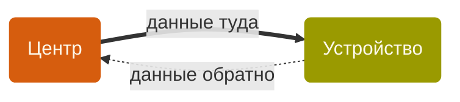
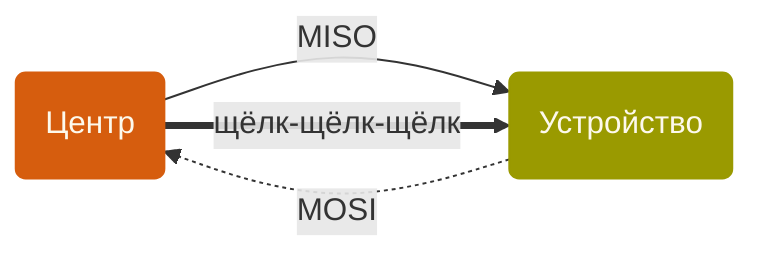
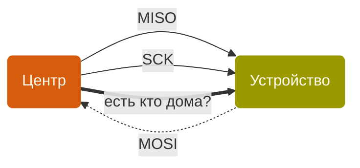
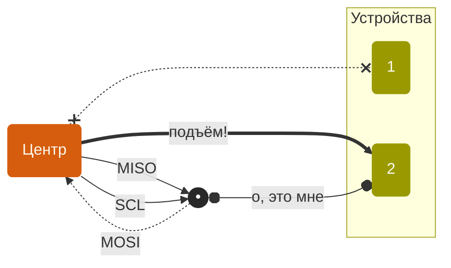

Youtube-запись от `2026-03-13`: https://youtu.be/fu_Bp8TxIzE

# SPI — не так уж много проводочков

## Как всегда, две микросхемы должны договориться

### Хотим двухполосное движение 

> [!NOTE]
> **туда** == `Main Out → Second In` == `MOSI`

> [!NOTE]
> **обратно** == `Second Out → Main In` == `MISO`

### Устройство — дальтоник с СДВГ
- Не отличает одну единицу от нескольких подряд — *ну а как?*
- Не может постоянно смотреть на вход и ловить нули и единички — *отвлекается*

Поэтому нужно «щёлкать пальцами», чтобы привлечь внимание устройства:

> [!NOTE]
> **щёлк-щёлк-щёлк** == `Serial Clock` == `SCK`

### И он ещё поспать любит!
Постучись, разбуди, потом уже разговаривай. *Ну, в первом приближении.*

> [!NOTE]
> **есть кто дома?** == `Chip Select` == `CS`

### Select как бы намекает…
Каждому устройству подавай отдельную линию-будильник.

- Конечно, можно размножать «будильники» и не на ножках микроконтроллера. Например, у нас уже был сдвиговый регистр для таких целей.
- Есть устройства (чипы), умеющие будить друг друга по цепочке. Но это экзотика.

> [!WARNING]
> Итого: быстро и просто.
> Немного сбивает с толку разнообразие вариантов и обозначений.

Тут-то мы и вспомним про внешнюю flash-память. Она же как раз на SPI!
Ссылка на каталог JEDEC ID: https://antenna-dvb-t2.ru/spi_nor_flash.php
