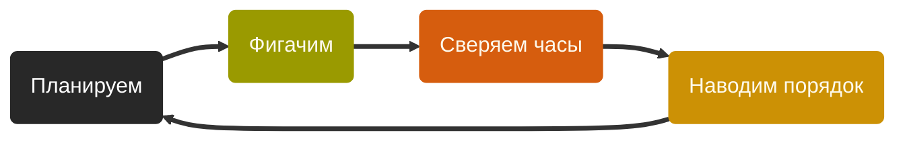

Youtube-запись от `2026-03-27`: https://youtu.be/Qfdj57R8h_U

# JSON как повод увидеть, что же мы творим
```json
{
  "user": {
    "id": 48,
    "name": "olga",
    "active": true
  },
  "roles": ["admin", "editor"],
  "meta": {
    "created": null,
    "score": 3.1415926
  }
}
```

## Где мы на старте
 - `JSON` нужен везде и всюду — да, даже в `C`
 - У нас есть описание с картинками: https://www.json.org/json-ru.html
 - И много подводных граблей: https://seriot.ch/software/parsing_json.html

## Zero Level
- Хотим понять: **перед нами `JSON` или не очень?**
- Начнём с самых простых.
- Вот прямо *самых-самых-самых* простых!


---
- работаем только со строками
- `whitespace` — пробел или ничего
- вообще без `string : value`

### Зафиксируем в примерах
> [!TIP]
> TRUE

`{}`
`{ }`

> [!CAUTION]
> FALSE

`{`
`{_`
`}`
`_}`

> [!TIP]
> FALSE → TRUE

`{__}`
`{→→}`
`{_→_→}`

• • •

*(всякие варианты про `whitespace`)*


#### Думаем параллельно обо всём сразу — и делаем тоже всё сразу

> [!IMPORTANT]
> Функциональность
> Что конкретно должна делать система
> **:LiBadgeQuestionMark: Как понять, система уже «делает это» или ещё нет?**
> - [x] Собирать и запускать код (да-да) ✅ 2026-03-27
> - [x] Уметь проверять строчку на JSON-овость (это основная задача) ✅ 2026-03-27
> - [x] Пройтись по примерам и проверить основную задачу на них ✅ 2026-03-27
> - [x] Показать результаты проверки примеров ✅ 2026-03-27

> [!TIP]
> Примеры
> Хорошие, плохие, вроде-бы-хорошие-но-пока-плохие, загадочные,…
> **:LiBadgeQuestionMark: Нам уже достаточно примеров, чтобы двигаться дальше?**
> - [x] Хорошие примеры, которые возвращают true ✅ 2026-03-27
> - [x] Плохие примеры, которые и должны возвращать false ✅ 2026-03-27
> - [x] Примеры, которые должны стать хорошими, но пока ведут себя как плохие ✅ 2026-03-27
> - [ ] Примеры, про которые мы пока не знаем, чего от них ждать

> [!CAUTION]
> Архитектура
> Функции, файлы, каталоги, библиотеки…
> **:LiBadgeQuestionMark: Когда уже пора усложнять?**
> - [ ] Самая простая структура файлов с кодом и данными
> - [ ] Самая простая!!!
> - [ ] И внутри файлов тоже всё «в лоб» без запаса

> [!TIP]
> Логика
> *Максимальный уровень абстракции при описании происходящего*
> **:LiBadgeQuestionMark: Нет ли способов сделать то же самое проще и изящней?**
> - [ ] Реализовать функциональность
> - [ ] Проверить реализацию функциональности
> - [ ] Структурировать примеры
> - [ ] Выявить полезные абстракции

> [!NOTE]
> Визуализация
> *Как показать происходящее, чтобы было понятно и полезно*
> **:LiBadgeQuestionMark: Может, ещё какой красоты наведём и информации добавим?**
> - [x] Вывести результат проверки одного примера ✅ 2026-03-27

> [!WARNING]
> Планирование
> Что делать сейчас, что на следующем шаге, что потом, а что вообще никогда?
> **:LiBadgeQuestionMark: Может, забить, и пусть оно всё само как-нибудь?**
> - [ ] Ввести временные ограничения — чтобы сделать хоть что-то
> - [ ] Решить, какой будет следующий шаг, и лежать в его сторону
> - [ ] Помнить, какая у нас глобальная цель, и не отвлекаться
> - [ ] Фиксировать состояние и прогресс

## Избавляемся от `whitespace`

### Ветки договариваются и фигачат
`pl` 🔆 Давайте избавимся от ограничения **«`whitespace` — это пробел»**

`fn` 👓 У меня никаких изменений не будет.

`ex` 👓 А у меня тесты `dream` переезжают в `true`.

`lg` 🍏 Как насчёт «первый + последний + всё между»?

`pl` ⛔ Этого `whitespace` у нас впереди много, а там первого и последнего символов не будет.

`lg` 🍏 Тогда так: «идём по порядку, игнорируем whitespace-символы, анализируем остальные».

`pl` 🔆 Звучит как что-то с запасом прочности, пробуем.

### Что-то натворили — пора наводить порядок
- [ ] `ar` Нужно материализовать действия «идём» и «игнорируем».
- [ ] `pl` Как только мы дойдём до key и value, начнутся проблемы — не забыть бы!
- [ ] `ex` Надо добавить разных странных наборов скобок. И в fail, и в dream.
- [ ] `fn` Хочется использовать комментарии в файлах примеров.

### Первая теория — внезапно в планировании


> [!NOTE]
> PDCA-цикл, он же цикл Дёминга
> - **P**lan — **D**o — **C**heck — **A**ct
> - Проявляется в любом действии, нацеленном на результат
> - Если у вас его нет — значит, вы застряли

## Посмотрим в сторону `string : value`

### Plan—Do

`pl` 🔆 Сделаем `string : string`. Для начала разрешаю одну пару.

`ex` 🍏 Сразу много всего докидываю, и это только начало!

> [!TIP]
> TRUE

`{a:b}`
`{ a : b }`
`{ abc : def }`
`{a123:b456}`


> [!CAUTION]
> FALSE

`{a:b:c}`
`{a:}`
`:b}`
`{1:2}}`

> [!TIP]
> IDK

`{1:2}`
`{я:ы}`
`{a:a}`

`lg` 🍏 Ооо, у меня тут много чего есть сказать!
```
всё ещё идём посимвольно, пробельное игнорим
убеждаемся, что первый символ — '{'
дальше читаем буквы, пока не встретим не-букву
если не-букве можно быть в string, идём дальше, иначе ой
как дошли до ':' — собираем все буквы в слово
дальше снова читаем буквы до не-буквы и т.д., но уже до '}'
и так собираем ещё одно слово
если благополучно добрались до '}', накопив два слова — хорошо
всё остальное плохо
и да, после '}' строка кончается, иначе опять плохо
```

`pl` ⛔ **Такую логику не ждёт светлое будущее. Безнадёжно.**

`lg` 🍏 Тогда хватит гулять посимвольно — пойдём большими кусками. Токенами.

`все хором` 🔥 Это что-то новенькое!

`pl` 🔆 Угу. Давайте посмотрим, каковы эти токены в реальности.

### Check—Act
- [ ] `pl` Для начала взяли не все виды токенов — надо потом дополнить.
- [ ] `lg` Вот мы токены выделили — и дальше с ними что?
