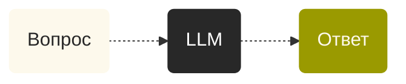
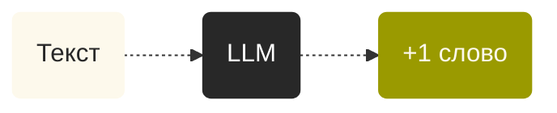
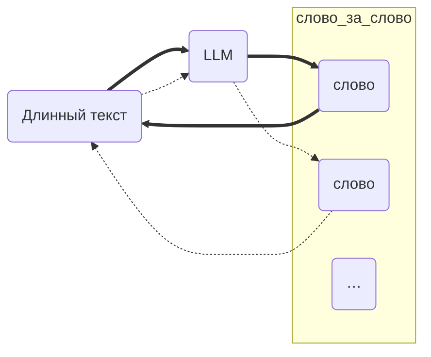

Youtube-запись от `2026-05-15`: https://youtu.be/c9pLgg0w488

# Используем C для обращений к LLM?!

## Что мы видим

### Магическое впечатление

### Занудная реальность

(картинки с троечником не нашлось — вот ведь интересно как)

### Но откуда же тогда впечатление?!

> [!TIP]
> Мы сами себе придумали, что тут есть вопрос и ответ

> мы шли по лесу вдруг аркадий  
> остановился у сосны  
> и воровато оглянувшись  
> сказал отличная сосна
> @ [sometimer](https://poetory.ru/authors/sometimer/all)
###### Что будет говорить ~~княгиня Марья Алексевна~~ LLM?

## 

---

## Отличная сосна! Потащили
*Источник фото — [Depositphotos](https://depositphotos.com/ru/photo/pine-tree-log-lie-in-a-forest-102002842.html). Вроде так можно.*

## Модель — мёртвые данные
- Много байтиков + инструкция по эксплуатации.
- [Hugging Face](https://huggingface.co) — популярный склад байтиков.
- [llama.cpp](https://github.com/ggml-org/llama.cpp) — популярный «верстак», на котором оживает инструкция.

## «Инференс» — заклинание оживления

- Инференс — это просто использование модели.
- Ну как «просто»…

Хорошо: инструкция есть.
Плохо: она на птичьем языке.

### Prefill — фаза «понимания» запроса

- Нужно оцифровать запрос.
- Суть — модель «готовится» наращивать запрос слово за словом.
- Эта фаза жрёт — время и ресурсы железа.
- А пользователи уже привыкли к мгновенным ответам!

> [!WARNING]
> Пахнет технической задачкой, правда?

Хорошо: математика наконец пригодится «в жизни».
Плохо: это не школьная и даже не всякого университета математика.

### Токенизация — это ещё ничего
> У меня есть словарь, я понимаю запросы только на нём.
> Вот какой алгорифм переводит человеческий текст «текст» на моём языке.
> Переведёте — поговорим.

---

Первая задача: перевести человеческий текст в слова из этого словаря.

Хорошая новость: алгорифмы общие для всех, их немного.
Плохая новость: словарь у каждой модели свой.

Словарь — это как профессиональный жаргон. Нужен для конкретных задач.
Можно без него? Можно. Но тогда и говорить будете только о погоде.

Алгорифмы года: **BPE** (Byte Pair Encoding), **WordPiece** и **Unigram**.

Интересный очевидный факт: последний слой модели всегда имеет размер, равный размеру словаря.

Алгорифмы на C/Rust + обвязка на Python
Сложность O(N) — легкотня!

Токен — это вектор. Цепочка чисел.
В каком пространстве?
Ну, завела там себе LLM пространство смыслов, простим её.

Главное — что теперь можно умножать этот вектор на матрицы! Ура!
