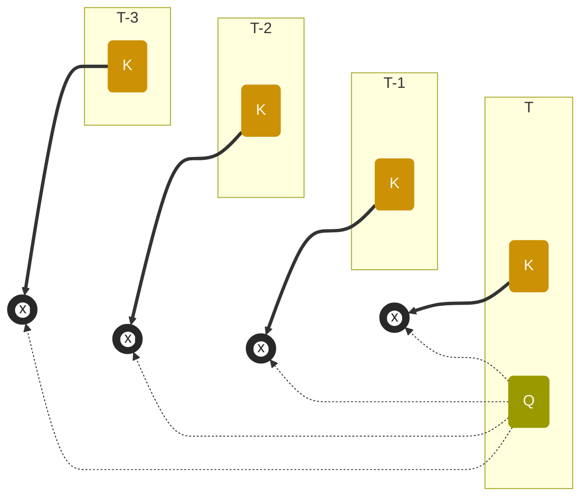
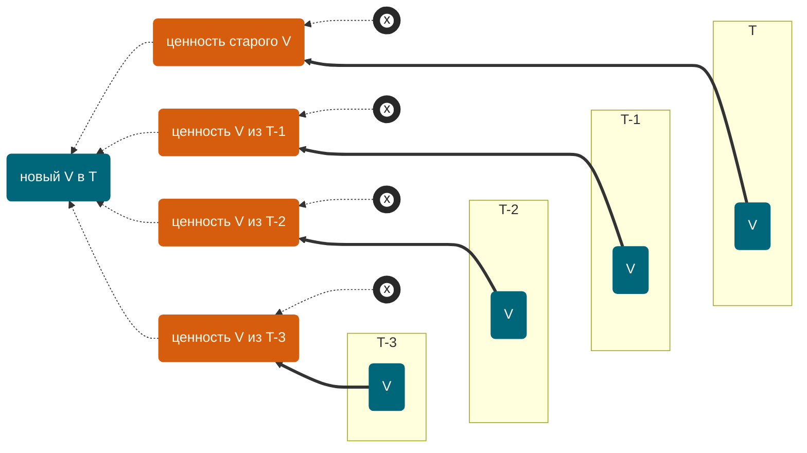

Youtube-запись от `2026-05-22`: https://youtu.be/c9pLgg0w488

---

…вот наш запрос переведён в последовательность токенов.
И он входит *куда-то*.

> [!TIP] Буквально давайте вместе с ним в ворота войдём

## Но потом каждый токен нужно снарядить…
> У нас тут, считай, маленький НИИ.
> 
> Чтобы токен работал в нём научным сотрудником, ему нужны три инструмента:
> - умение задавать вопросы `Q`
> - специализация `K`
> - багаж знаний `V`
> 
> Я дам каждому токену эти инструменты уже на старте.

---
Механика — три матрицы:
- `WQ` — «как тут принято задавать вопросы»
-  `WK` — «какие тут вообще бывают специализации»
- `WV` — «какие знания нужно копить»

> [!IMPORTANT]
> Забудьте всё, чему вас учили…

Умножаем три матрицы на наш вектор.
Получаем три разных вектора: `Q` — `K` — `V`

> [!TIP]
> Если наши входящие векторы сложить «стопкой», получится матрица.
> И умножать будем уже матрицы.
> Ну а чего сидеть.

Хорошо: можно распараллелить эти «обогащения».
Плохо: чёртова уйма умножений векторов и матриц.

И вот наш исходный вектор токена превратился в три:
- `Q` — **Query** — умение задавать вопросы.
- `K` — **Key** — специализация.
- `V` — **Value** — багаж знаний.

> [!WARNING] Эта конструкция эволюционно выжила
> А другие нет. Вот и всё. Метафоры пришли уже задним числом.

## …и взаимообогатить
- Свежеснаряжённые токены общаются-обогащаются между собой.
- Модель не участвует.

Вот как общается-обогащается отдельно взятый токен.

### 1️⃣ Сначала экспресс-опрос **предков**.


> [!INFO]
> Лучше учитывать и грамматическое расстояние.
> Это тоже происходит здесь. И добавляет вычислений.
> Но сложность растёт незначительно, пренебрежём.

### 2️⃣ Потом нормализация
- 🅧 + 🅧 + … + 🅧 = N → 1
- Но это быстро.
- Главное — не забыть.

### 3️⃣ А потом — пересмотр багажа *своих* знаний
Важно: с учётом опыта **предков** — и только предков.




## Два лаптя по карте

- [ggml](https://ggml.ai) — низкоуровневая прослойка к аппаратному умножению матриц
```
1B–3B модель:    100–300 × время 2048×2048
7B модель:       300–800 × время 4096×4096
13B модель:      500–1200 × время 5120×5120
70B модель:      1000+ × время 8192×8192
```

> [!IMPORTANT] … на токен!

- [OpenBLAS](https://www.openmathlib.org/OpenBLAS/) — человекогоды оптимизации вычислений


