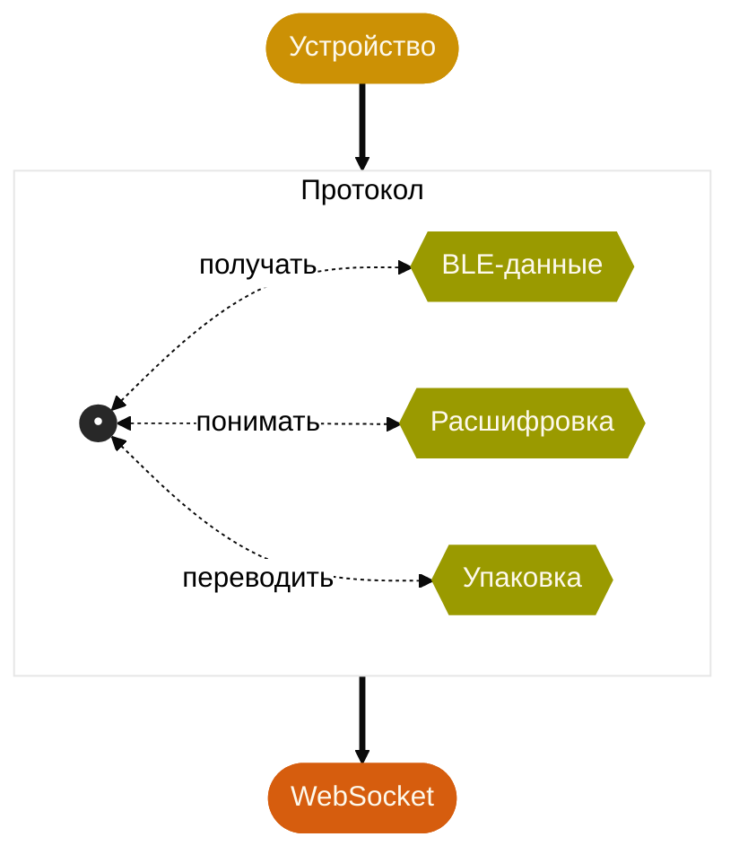
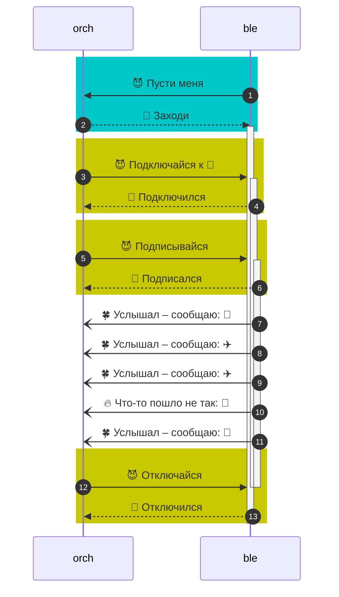
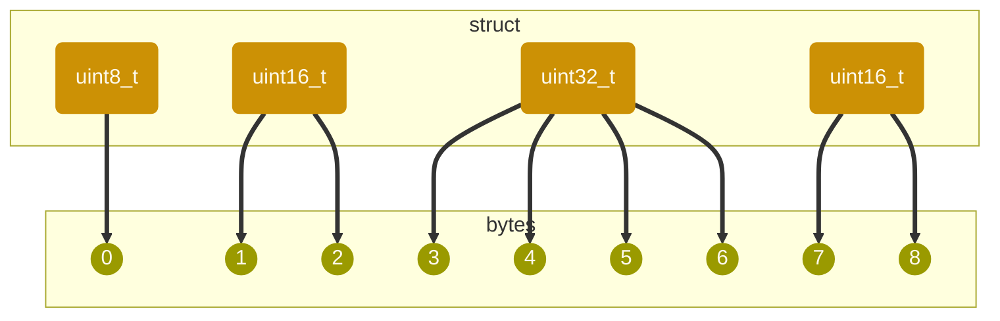

# Изобретаем велосипед для кубика — придумываем бинарный протокол

Youtube-запись от `2026-04-10`: https://youtu.be/awWuWUPUrGc

## Много-много процессов, аж целый сервер
- **На входе** — неизвестно как зашифрованные байты
- А **на выходе** нужен JSON-поток событий с кубиком

- Процессы общаются как угодно, но вряд ли JSON'ом :LiSmile: \
Между ними по сокетам ходят бинарные данные. В байтах.\
`00100111` `00110001` `10001111` `01100100` `10100111`\
&nbsp; \
&nbsp;
- Нам нужно **решить**, что, кому и зачем передавать
- А потом понять, как это делать **сырыми байтами**

## Что там у оркестратора с BLE?

### Содержание
1. Есть 😈 запросы и 🐰 ответы.
2. Есть просто сообщения — 🍀 хорошие и 🔥 так себе.
3. В запросах будут 🌈 подробности: куда подключиться?
4. В сообщениях точно будет 🚂 ✈️ 🥊 паровозик уточняющего контента.

### Форма
1. Ответ должен быть связан с запросом.
2. Для всего на свете полезны номера.

### Лучшие практики
1. Приличные процессы при встрече здороваются.
2. На старые письма не отвечаем.
3. ~~Анекдоты~~ Ошибки лучше сообщать по номерам.
4. Как всегда, стараемся форму отделить от содержания.

## И дальше прорабатываем бинарную реализацию

1. Little endian — типичное дело для бинарных протоколов внутри системы.
2. Лучше анонсировать каждое сообщение кодовым ~~звонком~~ словом.
3. Идея: фиксированный размер для формы и переменный — для содержания.
4. А кстати, какой будет размер у формы? Надо договориться.
5. Полезную нагрузку ограничим сверху, чтобы не зависать.
6. И дадим ей минимальный объём, чтобы не использовать динамическую память.

> [!TIP]
> Можно знать — но можно и догадаться.\
> Все эти идеи бросаются в глаза.\
> Но, конечно, удобно к ним привыкнуть.\
> Понаписав разных протоколов и поначитавшись чужих.
