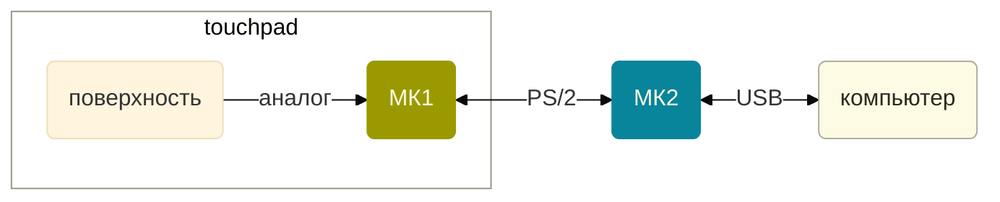

Youtube-запись от `2026-06-26`: https://youtu.be/kXayAW0BXDQ

# `=this.file.name`

> Рассказ про то, как вообще двигаться вперёд по непонятному

## Вначале была гора железа


- Очень старенькие
- Очень много
- Очень симпатичные
- Хочется спасти

### Есть смысл внимательно их рассмотреть
 - [ ] Нумеруем
 - [ ] Фотографируем
 - [ ] Ищем что-то общее
	 - [I] Всюду есть контроллер — и всюду неизвестно какой
	 - [i] Всюду есть разъём для шлейфа (и почти все одинаковые)
	 - [?] Иногда есть удобные «пятачки»
	 - [/] Никаких сверхсложных элементов нет

### После этого составляем картотеку

```mdx

manufacturer: alps
model:
controller: 1CA022A
interface:
voltage:
contacts: 12
distance:
testpoints: false
---

## Фото

## Распиновка

```

- Фото поворачиваем так, чтобы все разъёмы были в одном положении (скажем, шлейфом вверх)

### Что можно сделать сразу?
Полезное видео: https://www.youtube.com/watch?v=XdznW0ZuzGo
1. Найти землю — по контакту с большими площадками металла (обычное дело). Часто два контакта.
2. Найти питание — по RC-цепочке к земле или конденсатору к земле (а чаще и то, и то). Часто как минимум два контакта.
3. Дальше подаём питание (5 вольт? 3.3 вольт? неясно) и подключаем землю.
4. Ищем перебором все контактные площадки для пинов?
5. Начинаем программными средствами искать CLK и DATA (предполагаем, что перед нами протокол PS/2).
6. Могут быть и другие контакты — к кнопкам, например. Их сейчас не ищем.


## Картинка мечты


