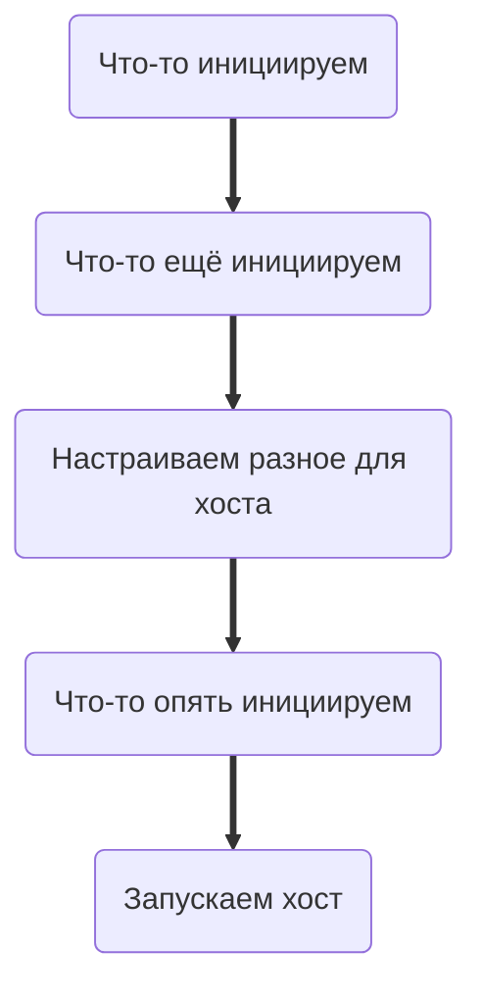

Youtube-запись от `2025-11-21`: https://youtu.be/spd1dQpZXus


# Внезапно Linux не смог
> [!WARNING] Шок-контент
> Да, Linux правда не позволяет **честно** писать клиентские приложения для прямого управления BLE-устройствами через отправку команд

```c
#define _POSIX_C_SOURCE 2
#include <stdio.h>
#include <stdlib.h>
#include <unistd.h>

// Команду отправляем с задержкой
void send(FILE * fp, char * command) {
     fprintf(fp, "%s\n", command);
     fflush(fp);
     sleep(5);
}

// Открываем процесс gatttool и работаем через него
int main() {
     FILE *fp = popen("gatttool -b 96:90:16:63:2D:25 -I", "w");
     if (fp == NULL) return 1;
     sleep(10);

     send(fp, "connect");
     send(fp, "char-write-req 0x0010 6b7570");
     send(fp, "disconnect");
     send(fp, "exit");

     pclose(fp);
     return EXIT_SUCCESS;
}
```


# Подцепим внешний Bluetooth-микроконтроллер
Возьмём [LILYGO T-Dongle S3](https://lilygo.cc/products/t-dongle-s3?srsltid=AfmBOopM8Fxo3qRYgZC_9iXzlN5-yiGgSRUfJthul9JDFqjX_jdQ_X11) — красавца с экраном и USB.

Но возьмём не за это, а за Bluetooth и **гигантскую** документацию по [ESP-EDF](https://docs.espressif.com/projects/esp-idf/en/latest/esp32s3/index.html).

~~Ну и ещё за то, что долго ждал в коробке.~~


## Подключаем плату и настраиваем проект
#### `lsusb` — увидеть подключение
`sudo dmesg -w` — отслеживать процесс подключения, чтобы узнать порт

#### `. $HOME/esp/esp-idf/export.sh` — инициализировать среду

> [!NOTE] И так в каждом терминале
> В частности, в каждом окне и в каждой панели `tmux`

#### `idf create-project` — инициировать проект
`main/CMakeLists.txt` — если менять имя `.c`-файла 

#### `idf set-target esp32s3` — указать микроконтроллер

## Медленно ползём по [ESP-EDF](https://docs.espressif.com/projects/esp-idf/en/latest/esp32s3/index.html)
> [!NOTE] [ESP-EDF](https://docs.espressif.com/projects/esp-idf/en/latest/esp32s3/index.html) всё время меняется
> Поэтому внешние источники всё время врут. Даже «умные».

### Выясняем, где тут вообще информация про :FabBluetooth:Bluetooth и BLE
Проходим про меню первого уровня:
- [API Reference → Bluetooth API → Bluetooth Low Energy](https://docs.espressif.com/projects/esp-idf/en/latest/esp32s3/api-reference/bluetooth/bt_le.html) — это явно справочник с деталями
- [API Guides → Bluetooth Low Energy](https://docs.espressif.com/projects/esp-idf/en/latest/esp32s3/api-guides/ble/index.html) — а вот тут есть шанс понять общую картинку

### Начинаем конспектировать добытые знания
> [!TIP] Можно и на бумаге
> А вот что нельзя, так это копипастить. Захлебнётесь.

#### [API Guides → Bluetooth Low Energy → Overview → Introduction](https://docs.espressif.com/projects/esp-idf/en/latest/esp32s3/api-guides/ble/overview.html)

* Нам нужно **пробраться через все четыре уровня**. Где-то что-то включить, где-то что-то настроить. И после этого мы сможем писать собственно приложение.
<br/>
* На каждом уровне — **свои** инструменты, своя архитектура, свои команды в инструментах, свои настройки железа и софта. И **выбирать это надо под сценарий**, который требуется в приложении.
<br/>
* А для других сценариев — **другие настройки**. И снова выбирать.
<br/>
* Просто сказать ~~**«У меня такой-то сценарий, настраивайся под него»**~~ — `не выйдет`. Всё-таки мы тут программируем.


##### 🔴 Контроллер
> [!TIP] Раз это железо, то, наверное, пригодится `idf menuconfig`?
> И правда, ещё как пригодится

→ Component Config → Bluetooth [on] → Host


- [x] `вопрос`Нужно как-то инициировать контроллер в коде? ✅ 2025-11-21

##### 🟢 Хост ESP-NimBLE
Это какая-то программа. Её надо запустить. Как?
Переходим по ссылке [ESP-NimBLE API references for initialization](https://docs.espressif.com/projects/esp-idf/en/latest/esp32s3/api-reference/bluetooth/nimble/index.html).
И снова конспектируем.
- **Threading Model** — значит, нас ждёт многопоточность, готовимся
- **Programming Sequence** — ооо, тебя-то мы и искали, правда ведь?

###### [… for initialization → Programming Sequence](https://docs.espressif.com/projects/esp-idf/en/latest/esp32s3/api-reference/bluetooth/nimble/index.html#programming-sequence)
1. Догадка про конфигурацию контроллера была удачной.
2. Дальше цепочка запусков, проработаем её.


###### [nvs_flash_init()](https://docs.espressif.com/projects/esp-idf/en/latest/esp32s3/api-reference/storage/nvs_flash.html#_CPPv414nvs_flash_initv) — первым делом инициируем NVS
> [!TIP] NVS — Non-Volatile Storage
> Энергонезависимая память. Выживает между перезагрузками. Нужна для ключей.

`esp_err_t nvs_flash_init(void)`
Никаких параметров.
На выходе — объект с инфой об ошибке.
**Рискнём.**
Что нам понадобится?
1. Подключение модуля — **API Reference → Header File**
2. Обработка ошибок — [Error Handling](https://docs.espressif.com/projects/esp-idf/en/latest/esp32s3/api-guides/error-handling.html) (да, мы снова ползём в документацию).
3. Логирование — [System API → Logging Library](https://docs.espressif.com/projects/esp-idf/en/latest/esp32s3/api-reference/system/log.html).
	- [x] Куда смотреть на логи? ✅ 2025-11-21

###### nimble_port_init() — теперь, говорят, нужен какой-то порт
- [ ] А эта функция вообще где? Не в ESP-IDF, похоже?

> [!TIP] Нам пригодится `grep` в каталоге, где установлен ESP

- [ ] Нам надо знать, что такое порт? ✅ 2025-11-21

Логи как бы намекают:


#### … а дальше как быть со схемой?
Больше из [API Guides → Bluetooth Low Energy → Overview → Introduction](https://docs.espressif.com/projects/esp-idf/en/latest/esp32s3/api-guides/ble/overview.html) не выжать. А со схемой мы ещё не разобрались.

> [!WARNING] Идём дальше, чтобы ответить на оставшиеся вопросы
> Дальше — это по документации. Очень медленно.

→ [API Guides → Bluetooth Low Energy → Get Started](https://docs.espressif.com/projects/esp-idf/en/latest/esp32s3/api-guides/ble/index.html#get-started)

